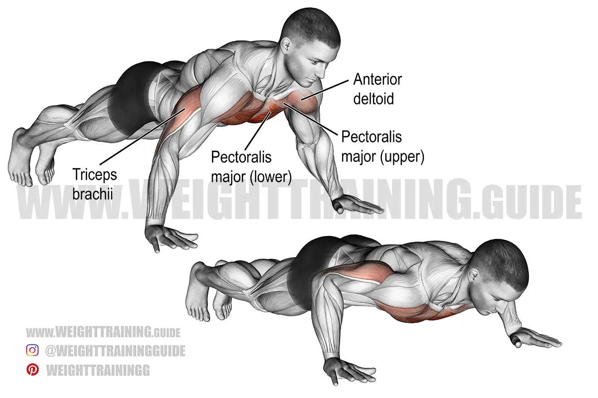

# Upper Body Exercise 1

## 1. **Standard Push-Up**
- Start in a plank position with your hands shoulder-width apart.
- Keep your back straight, lower your chest to the ground, and push back up.
- Repeat for 10–15 reps.

## 2. **Incline Push-Up**
- Place your hands on an elevated surface (like a sturdy table or bench).
- Perform the same movement as a standard push-up.
- This variation is great for beginners or as a warm-up.

## 3. **Diamond Push-Up**
- Position your hands close together, forming a diamond shape with your thumbs and index fingers.
- Lower your chest to the ground and push back up.
- This targets your triceps and chest muscles more intensely.

---

**Pro Tip:** Perform 3 sets of each variation, resting for 30 seconds between sets. Adjust the number of reps based on your fitness level.

Get ready to feel stronger and more energized! 💥
